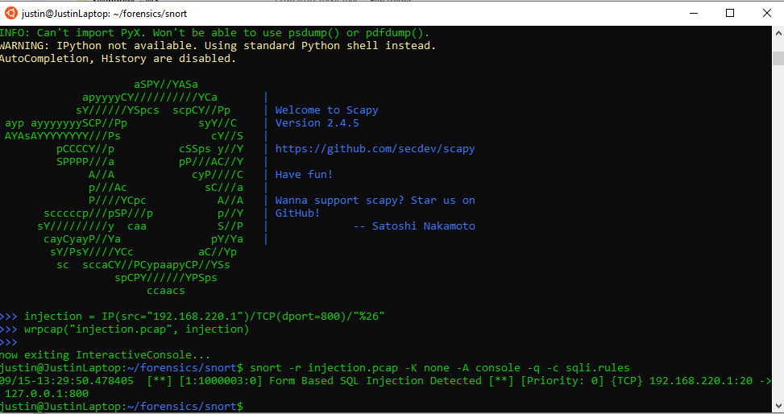

# Testing a Snort Rule that catches SQL Injection Attempts
Brian Busco, Ethan Thach, Kaden Makechnie-Hardy, Justin Mott, Quincy Taylor

## Outline
Snort is an open source tool for intrusion detection and intrusion prevention. Snort rules can inspect and analyze real time traffic. Our project's example rule detects packets with a single quote, which may indicate an SQL injection payload.

## Files

### rules.sqli
The Snort rule catches a packet with any source and any destination (destined for port 80) that contains a single quote in the payload. Snort flags this as a possible SQL injection attempt.
```
alert tcp any any -> any 80 (msg: "Form Based SQL Injection Detected"; content: "%27" ; sid:1000003; )
```
### injection.pcap

This pcap contains some packets that get caught and some that don't. See the table below for detail.


## How to Apply the Rule

STEP 1: Download Snort version 2.9.7 for your client [Snort Downloads](https://www.snort.org/downloads#snort-downloads).

STEP 2: Download Scapy (https://scapy.net/) or use `$ pip install --pre scapy[basic]` to download it in your Linux Subsystem (https://scapy.readthedocs.io/en/latest/installation.html).

STEP 3: Add the rule to a text file. `alert tcp any any -> any 80 (msg: "Form Based SQL Injection Detected"; content: "%27" ; sid:1000003; )`

STEP 4: Open Scapy and implement the command as seen below. Run `injection=IP(src="[IP address of source]")/TCP(dport=80)/"%27"` in Scapy to build the packet capture file. Next run the command `wrpcap("injection.pcap", injection)`. Then, `exit` scapy.

STEP 5: Run `snort -r injection.pcap -K none -A console -q -c sqli.rules`



## Packets

This table that contains what packets are to be caught or pass.

| Caught/Passed | Packet |
| ------ | ------ |
| Caught | single_quote_on_port_80=IP(src=“192.168.220.1”)/TCP(dport=80)/“%27" |
| Caught | singe_quote_on_port_81= IP(src=“192.168.220.1”)/TCP(dport=81)/“%27" |
| Caught |phrase_on_port_80= IP(src=“192.168.220.1”)/TCP(dport=80)/“Don%27t let me through!” |
| Passed | double_quote_on_port_80= IP(src=“192.168.220.1”)/TCP(dport=80)/“%22" |
| Passed | double_quote_on_port_81= IP(src=“192.168.220.1”)/TCP(dport=81)/“%22" |
| Passed | phrase_on_port_80= IP(src=“192.168.220.1”)/TCP(dport=80)/“Let me through!” |
| Passed | chess_phrase_on_port_80= IP(src=“192.168.220.1”)/TCP(dport=80)/“Justin is better than Magnus” |
